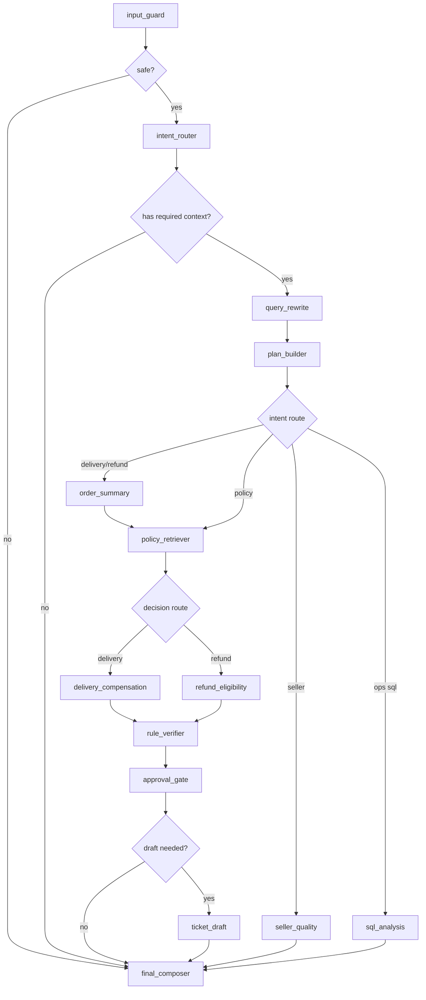

# Agent Workflow

Phase 7 adds the first real LangGraph orchestration layer for OrderOps Agent.

It does not replace the Phase 6 business tools. The graph is the coordinator: it decides whether the input is safe, what the user wants, what evidence is needed, which tool should run, whether a draft ticket is allowed, and what auditable answer should be returned.

## Entry Points

API:

```text
POST /api/agent/run
POST /api/chat
```

Local CLI:

```powershell
python scripts/run_agent_case.py "订单 1b3190b2dfa9d789e1f14c05b647a14a 延迟送达，是否可以赔付？" --order-id 1b3190b2dfa9d789e1f14c05b647a14a
```

## Main Files

- `apps/api/src/orderops_api/agent/state.py` defines request, output, step trace, plan, citations, and mutable graph state.
- `apps/api/src/orderops_api/agent/guard.py` contains deterministic guard rules, ID extraction, intent routing helpers, and approved SQL templates.
- `apps/api/src/orderops_api/agent/llm_planner.py` contains LLM prompts and structured response schemas for routing and final answer composition.
- `apps/api/src/orderops_api/agent/graph.py` builds the LangGraph state machine.
- `apps/api/src/orderops_api/llm/client.py` contains the OpenAI-compatible DeepSeek client.
- `apps/api/src/orderops_api/routers/agent.py` exposes the workflow through FastAPI.
- `scripts/run_agent_case.py` runs one local case from the command line.

## Graph Nodes



## What Each Node Does

`input_guard`

Blocks prompt injection, dangerous SQL intent, privacy-field extraction, and bypass wording before any tool runs.

`intent_router`

Routes the request into one of these intents:

- `delivery_compensation`
- `refund_review`
- `seller_quality`
- `ops_sql_analysis`
- `policy_qa`
- `blocked`
- `missing_context`

If `ORDEROPS_LLM_PROVIDER=deepseek` and `ORDEROPS_LLM_API_KEY` is set, this node asks the LLM for structured routing JSON first. If the LLM is unavailable or returns invalid JSON, the node falls back to deterministic routing.

`query_rewrite`

Turns the raw message into a retrieval/tool query and chooses policy document families when the intent is known. With LLM routing enabled, this uses the LLM's rewritten query after schema validation.

`plan_builder`

Creates a visible plan in the response. This is not hidden chain-of-thought; it is an auditable operational plan such as:

```text
get_order_summary -> search_policy -> check_delivery_compensation -> create_support_ticket_draft
```

`order_summary`

Calls the Phase 6 `get_order_summary` tool and records the result in `tool_calls`.

`policy_retriever`

Calls the Phase 6 `search_policy_tool` with BGE embedding, Qdrant vector search, and rerank according to the active RAG configuration.

`delivery_compensation` / `refund_eligibility`

Calls deterministic Phase 6 decision tools. The graph does not let the LLM invent refund or compensation decisions.

`rule_verifier`

Checks whether the business decision can proceed and whether manual approval is required.

`approval_gate`

Converts write-intent decisions into a pending approval state. The agent can create only draft tickets, not final refunds, payments, or real-world actions.

`ticket_draft`

Calls `create_support_ticket_draft` only when approval is required and `auto_create_ticket=true`.

`sql_analysis`

Runs only approved read-only SQL templates. It is not a free-form SQL console.

`final_composer`

Returns a concise answer plus structured fields: intent, decision, approval status, citations, tool calls, LLM calls, plan, and step trace. With LLM enabled, it asks the LLM to write the user-facing Chinese answer from audited tool results, without changing the deterministic decision.

## LLM Configuration

The project uses DeepSeek through its OpenAI-compatible API shape:

```powershell
ORDEROPS_LLM_PROVIDER=deepseek
ORDEROPS_LLM_API_KEY=your_key_here
ORDEROPS_LLM_MODEL=deepseek-v4-pro
ORDEROPS_LLM_THINKING_ENABLED=0
ORDEROPS_LLM_REASONING_EFFORT=medium
```

Do not commit the real key. Put it only in your local `.env`.

Provider presets fill the normal base URL, chat path, default model, and thinking-field adapter automatically. For common providers, you usually edit only:

```powershell
ORDEROPS_LLM_PROVIDER=deepseek
ORDEROPS_LLM_API_KEY=...
ORDEROPS_LLM_MODEL=...
```

Current built-in presets:

| Provider | Default base URL | Default model | Notes |
|---|---|---|---|
| `deepseek` | `https://api.deepseek.com` | `deepseek-v4-pro` | Uses DeepSeek-style thinking payload only when enabled |
| `siliconflow` | `https://api.siliconflow.cn/v1` | `Qwen/Qwen3-32B` | Uses SiliconFlow `enable_thinking` flag; set `.com` manually only for global keys |
| `openai` | `https://api.openai.com/v1` | `gpt-4.1-mini` | Generic OpenAI chat-compatible preset |
| `openai_compatible` | user-provided | user-provided | Requires `ORDEROPS_LLM_API_BASE_URL` |

LLM usage is intentionally limited:

- LLM may classify intent.
- LLM may rewrite retrieval queries.
- LLM may propose a visible tool plan.
- LLM may write the final answer.
- LLM may not decide refund or compensation eligibility.
- LLM may not bypass `input_guard`, SQL guard, or approval gate.

SiliconFlow can use the same client:

```powershell
ORDEROPS_LLM_PROVIDER=siliconflow
ORDEROPS_LLM_API_KEY=your_siliconflow_key
ORDEROPS_LLM_MODEL=Qwen/Qwen2.5-72B-Instruct
ORDEROPS_LLM_THINKING_ENABLED=0
```

The SiliconFlow documentation currently lists Qwen choices such as `Qwen/Qwen2.5-72B-Instruct`, `Qwen/Qwen2.5-72B-Instruct-128K`, and `Qwen/Qwen3-32B`. If you want a lower-cost smoke test first, use `Qwen/Qwen3-32B`.

## Current Boundaries

- The workflow remains tool-governed even when LLM routing is enabled; deterministic tools still make refund and compensation decisions.
- LLM routing and final composition are optional and require `ORDEROPS_LLM_API_KEY`.
- Streaming is accepted in the request schema but not implemented yet.
- Delivery/refund decision tools still perform a small internal policy lookup for safety. Phase 7 limits that second lookup to `top_k=1`, and local embedding/rerank providers are cached inside the API process.
- Trace details are returned in the API response, but there is not yet a separate trace storage/read endpoint.
- Evaluation metrics are Phase 8.

These boundaries are intentional for Phase 7: the graph now proves safe LLM-assisted orchestration and auditable tool execution before we add evaluation and richer conversation behavior.
